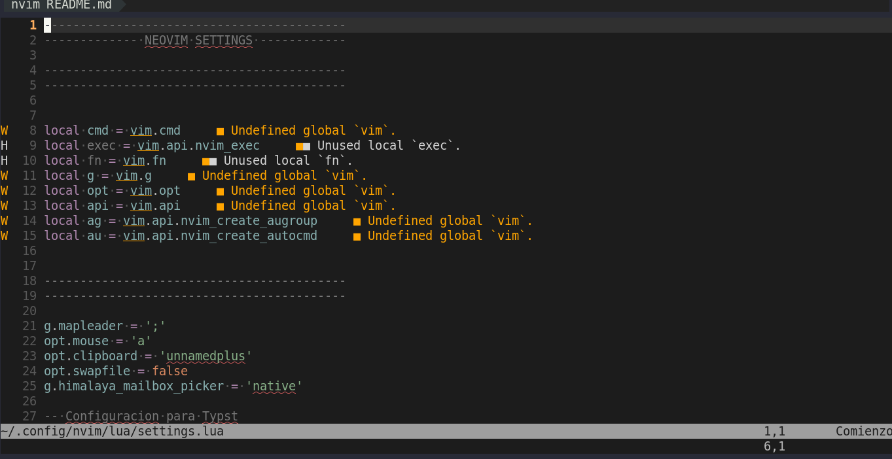
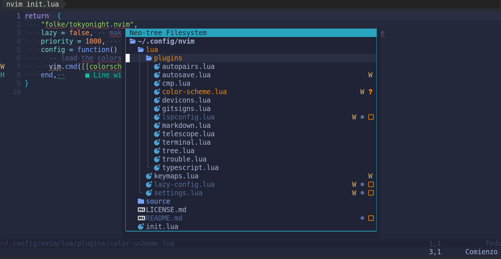

# Introducción

## 🚫 Requisitos:

- Neovim: [0.9.5](https://github.com/neovim/neovim/blob/master/INSTALL.md#install-from-download)

- Lazy: [Instalación](https://github.com/folke/lazy.nvim/blob/main/README.md?plain=1)

- Nerd fonts: [Enlace](https://www.nerdfonts.com/)

Antes de utilizar Neovim lo recomendado es aprender lo básico de [vim](https://www.google.com/search?channel=fs&client=ubuntu-sn&q=vim) ya que en mi caso me ayudo mucho a la hora de utilizar [nvim](https://neovim.io). Ya dominando los 2 factores estas listo para utilizar Lazy. Yo te recomiendo que transcribas el código, ya que solo copiar te costara algunos detalles.

## Algunos ejemplos

Prefiero mil veces este Neotree flotante (no se como se llame, yo le puse así). Siento que se ve bonito a comparación del tradicional que tienen otros editores de código como [vsc](https://code.visualstudio.com
).

